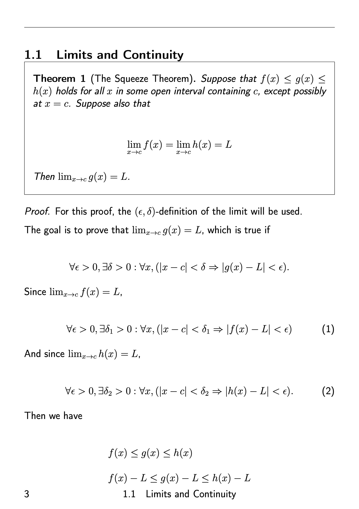
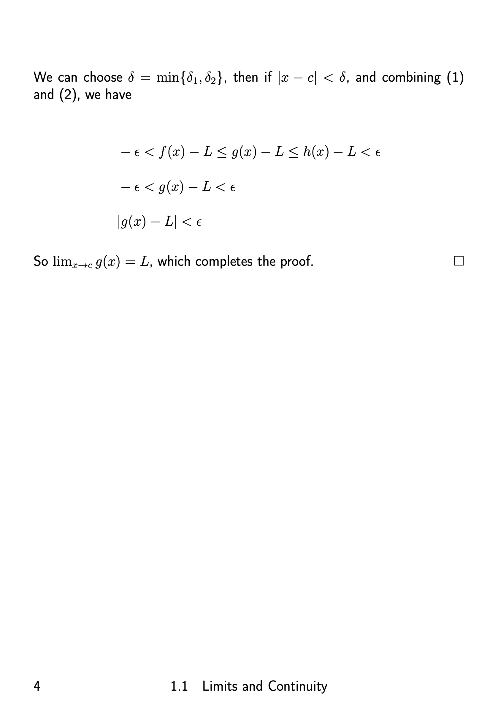

# Welcome 

This website is for hosting and sharing my notes and projects. Here under are some examples:

## Some projects with dynamical systems, explained in <a href='latex/gymnasiet/matematik/markdown/'><u>here</u></a> in swedish:

---

<video width="100%" height="100%" autoplay loop muted playsinline>
    <source src="./img/threeSuns.mp4" type="video/mp4">
    Your browser does not support the video tag.
</video>

<video width="100%" height="100%" autoplay loop muted playsinline>
    <source src="./img/doublePendulum2.mp4" type="video/mp4">
    Your browser does not support the video tag.
</video>

<!--
## Examples of notes from Single Variable Calculus:

---

--!>